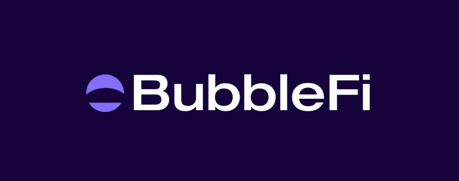

<!-- PROJECT SHIELDS -->

[![Contributors][contributors-shield]][contributors-url]
[![Forks][forks-shield]][forks-url]
[![Stargazers][stars-shield]][stars-url]
[![Issues][issues-shield]][issues-url]
[![MIT License][license-shield]][license-url]

<!-- PROJECT LOGO -->
<br />
<div align="center">
  <!-- <a href="https://github.com/Bubble-Finance/bubble-v1-protocol">
    
  </a> -->

  <h3 align="center">Bubble V1 Protocol</h3>

  <p align="center">
    Bubble is the #1 gamified and ecosystem-focused native DEX built on Monad
    <br />
    <a href="https://github.com/Bubble-Finance/bubble-v1-protocol/issues/new?labels=bug&template=bug-report---.md">Report Bug</a>
    ·
    <a href="https://github.com/Bubble-Finance/bubble-v1-protocol/issues/new?labels=enhancement&template=feature-request---.md">Request Feature</a>
  </p>
</div>

<!-- TABLE OF CONTENTS -->
<details>
  <summary>Table of Contents</summary>
  <ol>
    <li>
      <a href="#about-the-project">About The Project</a>
      <ul>
        <li><a href="#built-with">Built With</a></li>
      </ul>
    </li>
    <li>
      <a href="#getting-started">Getting Started</a>
      <ul>
        <li><a href="#prerequisites">Prerequisites</a></li>
        <li><a href="#installation">Installation</a></li>
      </ul>
    </li>
    <li><a href="#roadmap">Roadmap</a></li>
    <li><a href="#contributing">Contributing</a></li>
    <li><a href="#license">License</a></li>
    <li><a href="#contact">Contact</a></li>
  </ol>
</details>

<!-- ABOUT THE PROJECT -->

## About The Project



Welcome to Bubble, the #1 gamified and ecosystem-focused native DEX built on Monad. Bubble is the ultimate liquidity hub catering to the interests of both degens and mature traders alike with features such as MEV shield, gas sponsored swaps, raffle, launchpads, farms and more.

This repository houses the core and auxiliary smart contracts for Bubble v1. For those seeking non-technical, in-depth documentation, we have prepared a comprehensive guide available on [GitBook](https://bubblefi.gitbook.io/bubblefi). This resource is tailored to provide a thorough understanding of Bubble, its features, and how to get started, making it an invaluable asset for both newcomers and experienced users alike.

Join us in shaping the future of decentralized finance on Monad by contributing to Bubble. Whether you're a developer looking to build on our platform, a degen trader seeking a new exchange, or simply curious about the project, we welcome you to explore and engage with our community.

### Built With

- Solidity
- Foundry
- Pnpm

<!-- GETTING STARTED -->

## Getting Started

### Prerequisites

Make sure you have git, rust, foundry, node.js, and pnpm installed and configured on your system.

### Installation

Clone the repo,

```shell
git clone https://github.com/Bubble-Finance/bubble-v1-protocol.git
```

cd into the repo, and install the necessary dependencies

```shell
cd bubble-v1-protocol
pnpm i
forge build
```

Run tests by executing

```shell
forge test
```

That's it, you are good to go now!

<!-- ROADMAP -->

## Roadmap

-   [x] Smart contract development
-   [x] Unit tests
-   [x] Write a good README.md

See the [open issues](https://github.com/Bubble-Finance/bubble-v1-protocol/issues) for a full list of proposed features (and known issues).

<!-- CONTRIBUTING -->

## Contributing

Contributions are what make the open source community such an amazing place to learn, inspire, and create. Any contributions you make are **greatly appreciated**.

If you have a suggestion that would make this better, please fork the repo and create a pull request. You can also simply open an issue with the tag "enhancement".
Don't forget to give the project a star! Thanks again!

1. Fork the Project
2. Create your Feature Branch (`git checkout -b feature/AmazingFeature`)
3. Commit your Changes (`git commit -m 'Add some AmazingFeature'`)
4. Push to the Branch (`git push origin feature/AmazingFeature`)
5. Open a Pull Request

<!-- LICENSE -->

## License

Distributed under the MIT License. See `LICENSE.txt` for more information.

<!-- CONTACT -->

## Reach Out

[][discord-url]

[][x-url]


<!-- MARKDOWN LINKS & IMAGES -->
<!-- https://www.markdownguide.org/basic-syntax/#reference-style-links -->

[contributors-shield]: https://img.shields.io/github/contributors/Bubble-Finance/bubble-v1-protocol.svg?style=for-the-badge
[contributors-url]: https://github.com/Bubble-Finance/bubble-v1-protocol/graphs/contributors
[forks-shield]: https://img.shields.io/github/forks/Bubble-Finance/bubble-v1-protocol.svg?style=for-the-badge
[forks-url]: https://github.com/Bubble-Finance/bubble-v1-protocol/network/members
[stars-shield]: https://img.shields.io/github/stars/Bubble-Finance/bubble-v1-protocol.svg?style=for-the-badge
[stars-url]: https://github.com/Bubble-Finance/bubble-v1-protocol/stargazers
[issues-shield]: https://img.shields.io/github/issues/Bubble-Finance/bubble-v1-protocol.svg?style=for-the-badge
[issues-url]: https://github.com/Bubble-Finance/bubble-v1-protocol/issues
[license-shield]: https://img.shields.io/github/license/Bubble-Finance/bubble-v1-protocol.svg?style=for-the-badge
[license-url]: https://github.com/Bubble-Finance/bubble-v1-protocol/blob/master/LICENSE.txt
[discord-url]: https://discord.gg/gUG5fhF69D
[x-url]: https://x.com/Bubblefi_xyz
